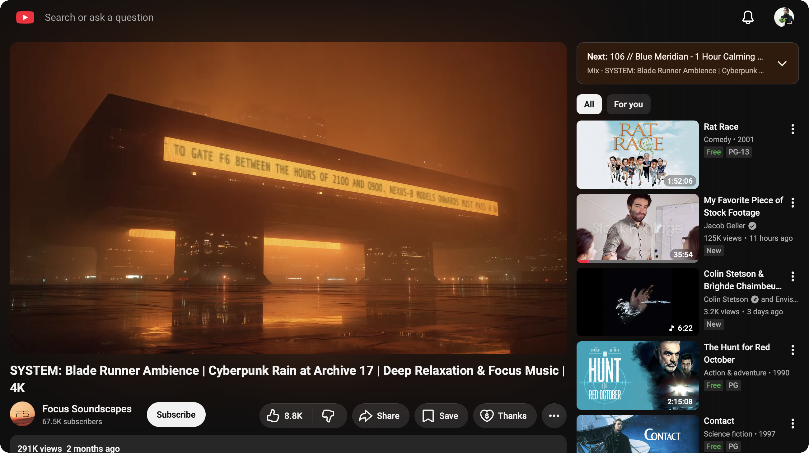

# YouTube for macOS

A tiny, native macOS wrapper that turns YouTube into a focused desktop app. It's a single Swift file (~290 lines) around a `WKWebView` — no Electron, no Xcode project, no dependencies. The web UI is trimmed down to just what you need, the window is chromeless and draggable from the masthead, and video gets an edge-to-edge in-window playback mode.


## Features

- **Chromeless, draggable window** — no traffic-light buttons, transparent titlebar, full-size content. Drag the window by any empty area of the masthead, just like a native title bar.
- **Trimmed masthead** — the sidebar/guide, hamburger toggle, upload/create button, voice search, and "Ask" button are removed. The YouTube logo is pinned to the left edge (cropped to the play glyph) and the search bar is left-aligned for a cleaner top bar.
- **History shortcut** — a clock button beside notifications opens YouTube's History page without restoring the sidebar.
- **Edge-to-edge in-window player** — YouTube's fullscreen button is repurposed into a **Full window** mode that fills the app window with just the video (no OS fullscreen, no menu-bar hiding). Robust across any window size — the player stays pinned to the window regardless of how YouTube re-lays-out the page. Press the button again or hit **Esc** to exit; it also resets automatically when you navigate away.
- **Stays logged in** — cookies persist in the default website data store, so you sign in once.
- **Mouse & gesture navigation** — hardware back/forward mouse buttons (buttons 4/5) go back/forward in history, and two-finger swipe back/forward gestures are enabled.
- **Sensible link handling** — `target=_blank` links open in the same view instead of dropping a dead pop-up.
- **Native menu bar** — a minimal menu provides the standard shortcuts (⌘Q quit, and ⌘Z/⌘X/⌘C/⌘V/⌘A editing) inside search and comment fields.
- **Hidden scrollbars** — scrolling still works; the bars just stay out of the way.

## Screenshots

**Watching a video** — standard layout with the trimmed masthead:



**Full window mode** — the same video filling the window edge-to-edge:


## Build

Requires macOS 12.0 or later and the Xcode command-line tools (for `swiftc`).

```sh
./build.sh
```

This compiles `main.swift` for both `arm64` and `x86_64`, merges them into a universal `YouTube.app` (runs natively on Apple Silicon and Intel), embeds the icon, and code-signs the bundle. To install it, drag `YouTube.app` into `/Applications`.

If a "Developer ID Application" certificate is in your keychain, `build.sh` signs with it (hardened runtime + secure timestamp); otherwise it falls back to an ad-hoc signature. Set `SIGN_ID` to pick a specific identity.

A build you compiled yourself launches without complaint. Gatekeeper only objects to apps that arrive with a *quarantine* flag — i.e. downloaded from the web — and for those, a signature alone is not enough: the app must also be notarized.

### Releasing a notarized build

One-time setup, using an app-specific password generated at
[account.apple.com](https://account.apple.com) → Sign-In and Security → App-Specific Passwords:

```sh
xcrun notarytool store-credentials notary \
    --apple-id you@example.com --team-id YOURTEAMID
```

Your Team ID is the parenthesized suffix in `security find-identity -v -p codesigning`.

Omitting `--password` makes it prompt, keeping the secret out of your shell history. It
validates with Apple before saving, so a failure here means no profile was written — the
Team ID must match the one that issued your signing certificate, and your team's Apple
Developer Program License Agreement must be current (an outdated one returns HTTP 403).

Then, per release:

```sh
./build.sh && ./notarize.sh
```

`notarize.sh` zips the bundle with `ditto` (plain `zip` discards the signature), submits it to Apple, waits for the result, staples the ticket to the `.app` so Gatekeeper clears it even offline, re-zips, and verifies with `spctl`. The resulting `YouTube-macos-<version>.zip` opens with a normal double-click on any Mac.

An unsigned or merely ad-hoc-signed build, by contrast, is blocked on a downloaded copy with
*"Apple could not verify YouTube is free of malware"* — which is why releases go through the
step above rather than asking users to override Gatekeeper.

### Regenerating the icon

The app icon is the YouTube play glyph, drawn programmatically:

```sh
swift gen_icon.swift        # writes icon_1024.png
# then convert to icon.iconset / YouTube.icns with iconutil if you change it
```

## Usage notes

| Action | How |
| --- | --- |
| Move the window | Drag an empty part of the masthead |
| Full window video | Click the player's fullscreen button |
| Exit full window | Click it again, or press **Esc** |
| Back / forward | Mouse buttons 4/5, or two-finger swipe |
| Quit | **⌘Q** |

## How it works

`main.swift` loads `youtube.com` in a `WKWebView` and injects one user script at document end. That script:

- applies the masthead/layout CSS and hides the unwanted buttons (re-running on a coalesced `MutationObserver` as YouTube's SPA re-renders),
- implements the Full window mode by toggling a class on `<html>` and pinning `#movie_player` to the window,
- and bridges masthead drags to the native window via a `WKScriptMessageHandler`, so `window.performDrag` moves the real window.

The Swift side hosts the web view, manages the chromeless window, wires up the mouse-button history navigation, and builds the menu bar.

## License

Personal project — YouTube is a trademark of Google LLC. This is an unofficial wrapper and is not affiliated with or endorsed by YouTube.
